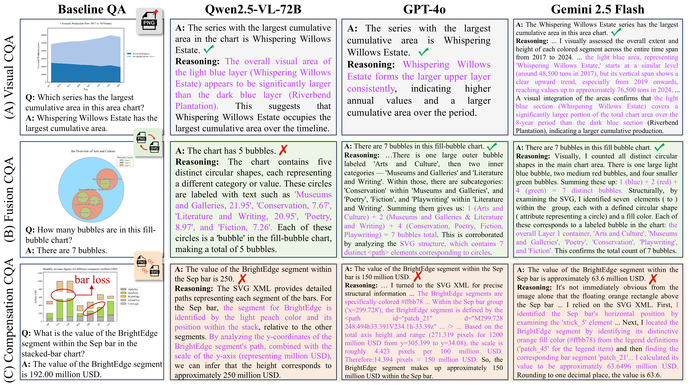
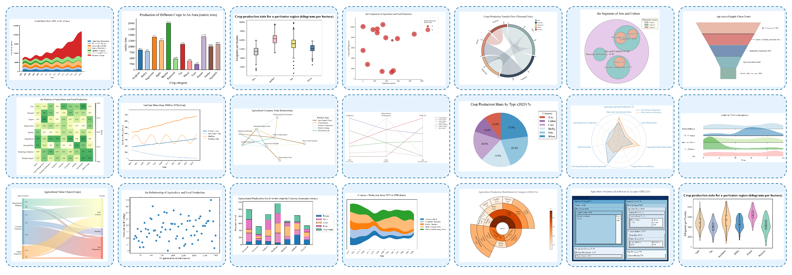

<link rel="stylesheet" href="assets/css/custom.css">

# ChartMind : Benchmark and Reasoning Insights of Multimodal Chart Question Answering

**Tong Li, Guodao Sun, Shunkai Wang, Zuoyu Tang, Yang Shu, Xueqian Zheng, Haixia Wang, Ronghua Liang**

  <a href="#" style="background-color: #2174A8; color: white; padding: 8px 16px; margin: 0 8px; text-decoration: none; border-radius: 5px; display: inline-block;">📑 Paper</a>
  <a href="#" style="background-color: #2174A8; color: white; padding: 8px 16px; margin: 0 8px; text-decoration: none; border-radius: 5px; display: inline-block;">⭐ Code</a>
  <a href="https://huggingface.co/datasets/guodaosun/Mega60k" style="background-color: #2174A8; color: white; padding: 8px 16px; margin: 0 8px; text-decoration: none; border-radius: 5px; display: inline-block;">🧱 Dataset</a>

## Abstract
Existing ChartQA evaluations for multimodal large language models focuses on visual-only input, and rely solely on "black-box" accuracy metrics, offering limited insight into reasoning traces. To fill these gaps, we introduce Mega60k, a benchmark covering 21 chart types and 11 QA tasks; collect ChartQA reasoning traces from MLLMs; and propose the reasoning deconstruction framework to parse multimodal activation patterns and reasoning evidence usage. Evaluating 12 representative MLLMs (7 open-source and 5 closed-source) under three conditions—visual-only, multimodal fusion, and multimodal compensation—reveals key findings: High-level tasks (multi-step logic, visual pattern recognition, layout optimization) serve as gold-standard for distinguishing MLLMs; Mere modality stacking struggles to extend reasoning boundaries but shows compensatory potential in quantitative visual understanding tasks; Gemini 2.5 Flash and GPT-4o demonstrate positive signals in leveraging structured modality reasoning to mitigate visual degradation such as omissions, occlusion, blurring, and rotation.

## Mega60k Overview

### 21 Chart Types

  

### 11 Question Tasks
- **Visual Understanding** - chart type recognition (CTR), visual element counting (VEC), spatial relation perception (SRP), and visual pattern recognition (VPR)
- **Numerical Analysis** - numerical extraction (NE), extremum value judgment (EVJ), statistical computation (SC), numerical filtering (NF), and numerical comparison (NC)
- **Logical Reasoning** - multi-step reasoning (MSR) and visual analysis (VA)

## Evaluation Space

### Evaluation Metrics

We employ six key metrics to comprehensively assess model performance:

- **TightAcc (Tacc)**: Exact keyword matching between model answers and ground truth for strict factual accuracy assessment.
- **RelaxAcc (Racc)**: Numerical accuracy with 5% error tolerance to account for unit conversion and precision variations.
- **MixAcc (Macc)**: Multiplicative combination of TightAcc and RelaxAcc for answers containing both textual and numerical elements.
- **Inference Time**: Time cost (in seconds) from input reception to answer generation.
- **Reasoning Tokens**: Token count in the model's explicit reasoning trace, reflecting thinking expansion degree.
- **Reasoning Drift**: Semantic deviation from question-answering context, measured using Sentence-BERT similarity between reasoning units and task context.

### Multimodal Evaluation
To evaluate the multimodal reasoning capabilities of MLLMs, we design three experimental configurations:

- **Visual**: Chart image + question → answer + reasoning (baseline)
- **Fusion**: Chart image + SVG + question → answer + reasoning  
- **Compensation**: Degraded chart image + SVG + question → answer + reasoning

<table class="tg" style="undefined;table-layout: fixed; width: 1474px"><colgroup>
<col style="width: 164px">
<col style="width: 98px">
<col style="width: 101px">
<col style="width: 101px">
<col style="width: 101px">
<col style="width: 101px">
<col style="width: 101px">
<col style="width: 101px">
<col style="width: 101px">
<col style="width: 101px">
<col style="width: 101px">
<col style="width: 101px">
<col style="width: 101px">
<col style="width: 101px">
</colgroup>
<thead>
  <tr>
    <th class="tg-larh" rowspan="2">MLLMs</th>
    <th class="tg-larh" rowspan="2">Eaperiment</th>
    <th class="tg-larh">CTR</th>
    <th class="tg-larh">VEC</th>
    <th class="tg-larh">SRP</th>
    <th class="tg-larh">VPR</th>
    <th class="tg-larh">VE</th>
    <th class="tg-larh">EVJ</th>
    <th class="tg-larh">SC</th>
    <th class="tg-larh">NF</th>
    <th class="tg-larh">NC</th>
    <th class="tg-larh">MSR</th>
    <th class="tg-larh">VA</th>
    <th class="tg-larh" rowspan="2">Average</th>
  </tr>
  <tr>
    <th class="tg-larh"><em>Tacc</em></th>
    <th class="tg-larh"><em>Racc</em></th>
    <th class="tg-larh"><em>Tacc</em></th>
    <th class="tg-larh"><em>Tacc/Racc</em></th>
    <th class="tg-larh"><em>Tacc/Racc</em></th>
    <th class="tg-larh"><em>Tacc/Racc</em></th>
    <th class="tg-larh"><em>Racc</em></th>
    <th class="tg-larh"><em>Macc</em></th>
    <th class="tg-larh"><em>Tacc/Racc</em></th>
    <th class="tg-larh"><em>Tacc/Racc</em></th>
    <th class="tg-larh"><em>Tacc/Racc</em></th>
  </tr></thead>
<tbody>
  <tr>
    <td class="tg-larh" colspan="14">open-source models</td>
  </tr>
  <tr>
    <td class="tg-vml0">CogVLM2</td>
    <td class="tg-vml0">visual</td>
    <td class="tg-49iy">5.80%</td>
    <td class="tg-49iy">15.30%</td>
    <td class="tg-49iy">16.20%</td>
    <td class="tg-49iy">7.30%</td>
    <td class="tg-49iy">7.00%</td>
    <td class="tg-49iy">5.20%</td>
    <td class="tg-49iy">2.90%</td>
    <td class="tg-49iy">4.50%</td>
    <td class="tg-49iy">35.90%</td>
    <td class="tg-49iy">5.80%</td>
    <td class="tg-49iy">11.40%</td>
    <td class="tg-49iy">10.66%</td>
  </tr>
  <tr>
    <td class="tg-vml0">LLaVA 1.5</td>
    <td class="tg-vml0">visual</td>
    <td class="tg-49iy">9.70%</td>
    <td class="tg-49iy">49.70%</td>
    <td class="tg-49iy">13.60%</td>
    <td class="tg-49iy">2.30%</td>
    <td class="tg-49iy">2.00%</td>
    <td class="tg-49iy">1.80%</td>
    <td class="tg-49iy">2.10%</td>
    <td class="tg-49iy">2.70%</td>
    <td class="tg-49iy">37.70%</td>
    <td class="tg-49iy">3.90%</td>
    <td class="tg-49iy">7.40%</td>
    <td class="tg-49iy">12.08%</td>
  </tr>
  <tr>
    <td class="tg-vml0">DeepSeek-VL2 </td>
    <td class="tg-vml0">visual</td>
    <td class="tg-49iy">85.80%</td>
    <td class="tg-49iy">74.80%</td>
    <td class="tg-49iy">52.90%</td>
    <td class="tg-49iy">31.00%</td>
    <td class="tg-49iy">40.50%</td>
    <td class="tg-49iy">32.70%</td>
    <td class="tg-49iy">11.90%</td>
    <td class="tg-49iy">16.00%</td>
    <td class="tg-49iy">49.30%</td>
    <td class="tg-49iy">19.20%</td>
    <td class="tg-49iy">28.30%</td>
    <td class="tg-49iy">40.22%</td>
  </tr>
  <tr>
    <td class="tg-vml0" rowspan="3">InternVL3</td>
    <td class="tg-vml0">visual</td>
    <td class="tg-49iy">75.90%</td>
    <td class="tg-49iy">84.10%</td>
    <td class="tg-49iy">57.10%</td>
    <td class="tg-49iy">29.59%</td>
    <td class="tg-49iy">58.10%</td>
    <td class="tg-49iy">45.70%</td>
    <td class="tg-49iy">35.40%</td>
    <td class="tg-49iy">21.50%</td>
    <td class="tg-49iy">64.60%</td>
    <td class="tg-49iy">22.60%</td>
    <td class="tg-49iy">27.80%</td>
    <td class="tg-49iy">47.49%</td>
  </tr>
  <tr>
    <td class="tg-vml0">fusion</td>
    <td class="tg-49iy">76.50%↑</td>
    <td class="tg-49iy">75.60%↓</td>
    <td class="tg-49iy">22.80%↓</td>
    <td class="tg-49iy">4.00%↓</td>
    <td class="tg-49iy">10.10%↓</td>
    <td class="tg-49iy">5.10%↓</td>
    <td class="tg-49iy">40.70%↑</td>
    <td class="tg-49iy">18.50%↓</td>
    <td class="tg-49iy">49.50%↓</td>
    <td class="tg-49iy">4.10%↓</td>
    <td class="tg-49iy">1.50%↓</td>
    <td class="tg-49iy">28.04%↓</td>
  </tr>
  <tr>
    <td class="tg-vml0">compensation</td>
    <td class="tg-49iy">88.10%↑</td>
    <td class="tg-49iy">88.00%↑</td>
    <td class="tg-49iy">50.00%↓</td>
    <td class="tg-49iy">23.3%↓</td>
    <td class="tg-49iy">75.20%↑</td>
    <td class="tg-49iy">48.00%↑</td>
    <td class="tg-49iy">55.80%↑</td>
    <td class="tg-49iy">17.10%↓</td>
    <td class="tg-49iy">63.00%↓</td>
    <td class="tg-49iy">8.10%↓</td>
    <td class="tg-49iy">45.50%↑</td>
    <td class="tg-49iy">51.10%↑</td>
  </tr>
  <tr>
    <td class="tg-vml0" rowspan="3">LLaMA4 Maverick</td>
    <td class="tg-vml0">visual</td>
    <td class="tg-49iy">100.00%</td>
    <td class="tg-49iy">84.90%</td>
    <td class="tg-49iy">73.60%</td>
    <td class="tg-49iy">46.30%</td>
    <td class="tg-49iy">56.80%</td>
    <td class="tg-49iy">49.70%</td>
    <td class="tg-49iy">47.50%</td>
    <td class="tg-49iy">28.40%</td>
    <td class="tg-49iy">71.60%</td>
    <td class="tg-49iy">39.10%</td>
    <td class="tg-49iy">38.80%</td>
    <td class="tg-49iy">57.88%</td>
  </tr>
  <tr>
    <td class="tg-vml0">fusion</td>
    <td class="tg-49iy">100.00%</td>
    <td class="tg-49iy">84.40%↓</td>
    <td class="tg-49iy">48.80%↓</td>
    <td class="tg-49iy">23.90%↓</td>
    <td class="tg-49iy">25.50%↓</td>
    <td class="tg-49iy">19.50%↓</td>
    <td class="tg-49iy">22.40%↓</td>
    <td class="tg-49iy">10.70%↓</td>
    <td class="tg-49iy">56.80%↓</td>
    <td class="tg-49iy">19.70%↓</td>
    <td class="tg-49iy">19.90%↓</td>
    <td class="tg-49iy">39.24%↓</td>
  </tr>
  <tr>
    <td class="tg-vml0">compensation</td>
    <td class="tg-49iy">99.90%↓</td>
    <td class="tg-49iy">86.30%↑</td>
    <td class="tg-49iy">63.30%↓</td>
    <td class="tg-49iy">36.70%↓</td>
    <td class="tg-49iy">41.70%↓</td>
    <td class="tg-49iy">38.90%↓</td>
    <td class="tg-49iy">32.60%↓</td>
    <td class="tg-49iy">18.80%↓</td>
    <td class="tg-49iy">62.30%↓</td>
    <td class="tg-49iy">30.40%↓</td>
    <td class="tg-49iy">22.40%↓</td>
    <td class="tg-49iy">48.48%↓</td>
  </tr>
  <tr>
    <td class="tg-vml0" rowspan="3">Qwen2.5-VL-32B</td>
    <td class="tg-vml0">visual</td>
    <td class="tg-49iy">99.10%</td>
    <td class="tg-49iy">84.90%</td>
    <td class="tg-49iy">69.60%</td>
    <td class="tg-49iy">40.60%</td>
    <td class="tg-49iy">53.90%</td>
    <td class="tg-49iy">45.10%</td>
    <td class="tg-49iy">37.20%</td>
    <td class="tg-49iy">24.40%</td>
    <td class="tg-49iy">64.60%</td>
    <td class="tg-49iy">36.10%</td>
    <td class="tg-49iy">36.40%</td>
    <td class="tg-49iy">53.81%</td>
  </tr>
  <tr>
    <td class="tg-vml0">fusion</td>
    <td class="tg-49iy">99.10%</td>
    <td class="tg-49iy">84.90%</td>
    <td class="tg-49iy">68.30%↓</td>
    <td class="tg-49iy">38.40%↓</td>
    <td class="tg-49iy">48.80%↓</td>
    <td class="tg-49iy">43.50%↓</td>
    <td class="tg-49iy">33.80%↓</td>
    <td class="tg-49iy">21.70%↓</td>
    <td class="tg-49iy">63.10%↓</td>
    <td class="tg-49iy">32.90%↓</td>
    <td class="tg-49iy">34.30%↓</td>
    <td class="tg-49iy">51.71%↓</td>
  </tr>
  <tr>
    <td class="tg-vml0">compensation</td>
    <td class="tg-49iy">99.10%</td>
    <td class="tg-49iy">81.90%↓</td>
    <td class="tg-49iy">57.60%↓</td>
    <td class="tg-49iy">27.70%↓</td>
    <td class="tg-49iy">37.30%↓</td>
    <td class="tg-49iy">33.60%↓</td>
    <td class="tg-49iy">25.70%↓</td>
    <td class="tg-49iy">14.20%↓</td>
    <td class="tg-49iy">56.70%↓</td>
    <td class="tg-49iy">25.70%↓</td>
    <td class="tg-49iy">29.40%↓</td>
    <td class="tg-49iy">44.45%↓</td>
  </tr>
  <tr>
    <td class="tg-vml0" rowspan="3">Qwen2.5-VL-72B</td>
    <td class="tg-vml0">visual</td>
    <td class="tg-49iy">99.80%</td>
    <td class="tg-49iy">85.00%</td>
    <td class="tg-49iy">69.50%</td>
    <td class="tg-49iy">39.80%</td>
    <td class="tg-49iy">58.50%</td>
    <td class="tg-49iy">47.00%</td>
    <td class="tg-49iy">43.30%</td>
    <td class="tg-49iy">23.80%</td>
    <td class="tg-49iy">67.80%</td>
    <td class="tg-49iy">37.30%</td>
    <td class="tg-49iy">34.30%</td>
    <td class="tg-49iy">55.10%</td>
  </tr>
  <tr>
    <td class="tg-vml0">fusion</td>
    <td class="tg-49iy">99.40%↓</td>
    <td class="tg-49iy">86.70%↑</td>
    <td class="tg-49iy">66.30%↓</td>
    <td class="tg-49iy">36.10%↓</td>
    <td class="tg-49iy">52.30%↓</td>
    <td class="tg-49iy">44.50%↓</td>
    <td class="tg-49iy">37.80%↓</td>
    <td class="tg-49iy">20.80%↓</td>
    <td class="tg-49iy">64.60%↓</td>
    <td class="tg-49iy">32.80%↓</td>
    <td class="tg-49iy">34.60%↑</td>
    <td class="tg-49iy">52.35%↓</td>
  </tr>
  <tr>
    <td class="tg-vml0">compensation</td>
    <td class="tg-49iy">99.00%↓</td>
    <td class="tg-49iy">84.20%↓</td>
    <td class="tg-49iy">57.80%↓</td>
    <td class="tg-49iy">26.90%↓</td>
    <td class="tg-49iy">38.00%↓</td>
    <td class="tg-49iy">35.70%↓</td>
    <td class="tg-49iy">27.90%↓</td>
    <td class="tg-49iy">13.40%↓</td>
    <td class="tg-49iy">58.00%↓</td>
    <td class="tg-49iy">25.10%↓</td>
    <td class="tg-49iy">28.50%↓</td>
    <td class="tg-49iy">44.95%↓</td>
  </tr>
  <tr>
    <td class="tg-larh" colspan="14">closed-source models</td>
  </tr>
  <tr>
    <td class="tg-vml0" rowspan="3">Claude 3.5 Haiku</td>
    <td class="tg-vml0">visual</td>
    <td class="tg-49iy">100.00%</td>
    <td class="tg-49iy">85.20%</td>
    <td class="tg-49iy">67.10%</td>
    <td class="tg-49iy">40.00%</td>
    <td class="tg-49iy">53.40%</td>
    <td class="tg-49iy">46.50%</td>
    <td class="tg-49iy">33.90%</td>
    <td class="tg-49iy">23.00%</td>
    <td class="tg-49iy">65.60%</td>
    <td class="tg-49iy">32.30%</td>
    <td class="tg-49iy">32.50%</td>
    <td class="tg-49iy">52.68%</td>
  </tr>
  <tr>
    <td class="tg-vml0">fusion</td>
    <td class="tg-49iy">100.00%</td>
    <td class="tg-49iy">87.80%↑</td>
    <td class="tg-49iy">65.10%↓</td>
    <td class="tg-49iy">38.50%↓</td>
    <td class="tg-49iy">51.30%↓</td>
    <td class="tg-49iy">45.30%↓</td>
    <td class="tg-49iy">31.40%↓</td>
    <td class="tg-49iy">22.50%↓</td>
    <td class="tg-49iy">62.80%↓</td>
    <td class="tg-49iy">33.00%↑</td>
    <td class="tg-49iy">29.90%↓</td>
    <td class="tg-49iy">51.60%↓</td>
  </tr>
  <tr>
    <td class="tg-vml0">compensation</td>
    <td class="tg-49iy">99.60%↓</td>
    <td class="tg-49iy">91.00%↑</td>
    <td class="tg-49iy">57.90%↓</td>
    <td class="tg-49iy">27.20%↓</td>
    <td class="tg-49iy">37.60%↓</td>
    <td class="tg-49iy">40.10%↓</td>
    <td class="tg-49iy">22.60%↓</td>
    <td class="tg-49iy">18.20%↓</td>
    <td class="tg-49iy">56.40%↓</td>
    <td class="tg-49iy">28.90%↓</td>
    <td class="tg-49iy">24.00%↓</td>
    <td class="tg-49iy">45.77%↓</td>
  </tr>
  <tr>
    <td class="tg-vml0" rowspan="3">GLM-4V-Plus</td>
    <td class="tg-vml0">visual</td>
    <td class="tg-49iy">99.90%</td>
    <td class="tg-49iy">85.50%</td>
    <td class="tg-49iy">73.70%</td>
    <td class="tg-49iy">47.00%</td>
    <td class="tg-49iy">63.80%</td>
    <td class="tg-49iy">53.30%</td>
    <td class="tg-49iy">45.00%</td>
    <td class="tg-49iy">27.30%</td>
    <td class="tg-49iy">76.20%</td>
    <td class="tg-49iy">42.30%</td>
    <td class="tg-49iy">40.20%</td>
    <td class="tg-49iy">59.47%</td>
  </tr>
  <tr>
    <td class="tg-vml0">fusion</td>
    <td class="tg-49iy">99.70%↓</td>
    <td class="tg-49iy">81.40%↓</td>
    <td class="tg-49iy">62.20%↓</td>
    <td class="tg-49iy">38.10%↓</td>
    <td class="tg-49iy">46.50%↓</td>
    <td class="tg-49iy">42.80%↓</td>
    <td class="tg-49iy">33.90%↓</td>
    <td class="tg-49iy">18.70%↓</td>
    <td class="tg-49iy">68.30%↓</td>
    <td class="tg-49iy">32.40%↓</td>
    <td class="tg-49iy">35.90%↓</td>
    <td class="tg-49iy">50.90%↓</td>
  </tr>
  <tr>
    <td class="tg-vml0">compensation</td>
    <td class="tg-49iy">99.30%↓</td>
    <td class="tg-49iy">80.60%↓</td>
    <td class="tg-49iy">54.50%↓</td>
    <td class="tg-49iy">31.10%↓</td>
    <td class="tg-49iy">38.40%↓</td>
    <td class="tg-49iy">35.00%↓</td>
    <td class="tg-49iy">28.30%↓</td>
    <td class="tg-49iy">16.30%↓</td>
    <td class="tg-49iy">63.10%↓</td>
    <td class="tg-49iy">28.10%↓</td>
    <td class="tg-49iy">27.30%↓</td>
    <td class="tg-49iy">45.64%↓</td>
  </tr>
  <tr>
    <td class="tg-vml0" rowspan="3">Doubao 1.5   Vision-Pro</td>
    <td class="tg-vml0">visual</td>
    <td class="tg-49iy">100.00%</td>
    <td class="tg-49iy">86.00%</td>
    <td class="tg-49iy">75.60%</td>
    <td class="tg-49iy">44.20%</td>
    <td class="tg-49iy">63.10%</td>
    <td class="tg-49iy">48.80%</td>
    <td class="tg-49iy">41.30%</td>
    <td class="tg-49iy">35.20%</td>
    <td class="tg-49iy">72.60%</td>
    <td class="tg-49iy">42.20%</td>
    <td class="tg-49iy">46.30%</td>
    <td class="tg-49iy">59.57%</td>
  </tr>
  <tr>
    <td class="tg-vml0">fusion</td>
    <td class="tg-49iy">100.00%</td>
    <td class="tg-49iy">87.20%↑</td>
    <td class="tg-49iy">73.10%↓</td>
    <td class="tg-49iy">44.90%↑</td>
    <td class="tg-49iy">60.30%↓</td>
    <td class="tg-49iy">51.30%↑</td>
    <td class="tg-49iy">38.70%↓</td>
    <td class="tg-49iy">34.60%↓</td>
    <td class="tg-49iy">71.50%↓</td>
    <td class="tg-49iy">36.90%↓</td>
    <td class="tg-49iy">43.90%↓</td>
    <td class="tg-49iy">58.40%↓</td>
  </tr>
  <tr>
    <td class="tg-vml0">compensation</td>
    <td class="tg-49iy">99.7%↓</td>
    <td class="tg-49iy">85.80%↓</td>
    <td class="tg-49iy">61.50%↓</td>
    <td class="tg-49iy">32.10%↓</td>
    <td class="tg-49iy">42.50%↓</td>
    <td class="tg-49iy">38.70%↓</td>
    <td class="tg-49iy">23.70%↓</td>
    <td class="tg-49iy">21.50%↓</td>
    <td class="tg-49iy">58.80%↓</td>
    <td class="tg-49iy">23.70%↓</td>
    <td class="tg-49iy">22.50%↓</td>
    <td class="tg-49iy">46.41%↓</td>
  </tr>
  <tr>
    <td class="tg-vml0" rowspan="3">GPT-4o</td>
    <td class="tg-vml0">visual</td>
    <td class="tg-49iy">100.00%</td>
    <td class="tg-49iy">89.40%</td>
    <td class="tg-49iy">80.90%</td>
    <td class="tg-49iy">55.10%</td>
    <td class="tg-49iy">77.80%</td>
    <td class="tg-49iy">59.20%</td>
    <td class="tg-49iy">61.00%</td>
    <td class="tg-49iy">41.70%</td>
    <td class="tg-49iy">77.10%</td>
    <td class="tg-49iy">52.40%</td>
    <td class="tg-49iy">44.90%</td>
    <td class="tg-49iy">67.23%</td>
  </tr>
  <tr>
    <td class="tg-vml0">fusion</td>
    <td class="tg-49iy">100.00%</td>
    <td class="tg-49iy">90.50%↑</td>
    <td class="tg-49iy">80.10%↓</td>
    <td class="tg-49iy">57.49%↑</td>
    <td class="tg-49iy">70.70%↓</td>
    <td class="tg-49iy">55.00%↓</td>
    <td class="tg-49iy">56.60%↓</td>
    <td class="tg-49iy">39.10%↓</td>
    <td class="tg-49iy">74.80%↓</td>
    <td class="tg-49iy">54.50%↑</td>
    <td class="tg-49iy">35.20%↓</td>
    <td class="tg-49iy">64.91%↓</td>
  </tr>
  <tr>
    <td class="tg-vml0">compensation</td>
    <td class="tg-49iy">100.00%</td>
    <td class="tg-49iy">87.60%↓</td>
    <td class="tg-49iy">70.60%↓</td>
    <td class="tg-49iy">45.50%↓</td>
    <td class="tg-49iy">52.90%↓</td>
    <td class="tg-49iy">47.40%↓</td>
    <td class="tg-49iy">44.90%↓</td>
    <td class="tg-49iy">31.90%↓</td>
    <td class="tg-49iy">67.20%↓</td>
    <td class="tg-49iy">38.10%↓</td>
    <td class="tg-49iy">22.30%↓</td>
    <td class="tg-49iy">55.31%↓</td>
  </tr>
  <tr>
    <td class="tg-vml0" rowspan="3">Gemini 2.5 Flash</td>
    <td class="tg-vml0">visual</td>
    <td class="tg-49iy">99.50%</td>
    <td class="tg-49iy">88.60%</td>
    <td class="tg-49iy">81.40%</td>
    <td class="tg-49iy">53.90%</td>
    <td class="tg-49iy">67.90%</td>
    <td class="tg-49iy">56.90%</td>
    <td class="tg-49iy">56.50%</td>
    <td class="tg-49iy">44.20%</td>
    <td class="tg-49iy">82.10%</td>
    <td class="tg-49iy">58.10%</td>
    <td class="tg-49iy">45.80%</td>
    <td class="tg-49iy">66.81%</td>
  </tr>
  <tr>
    <td class="tg-vml0">fusion</td>
    <td class="tg-49iy">99.60%↑</td>
    <td class="tg-49iy">95.20%↑</td>
    <td class="tg-49iy">84.00%↑</td>
    <td class="tg-49iy">58.40%↑</td>
    <td class="tg-49iy">73.00%↑</td>
    <td class="tg-49iy">61.40%↑</td>
    <td class="tg-49iy">64.90%↑</td>
    <td class="tg-49iy">52.60%↑</td>
    <td class="tg-49iy">84.30%↑</td>
    <td class="tg-49iy">65.80%↑</td>
    <td class="tg-49iy">46.70%↑</td>
    <td class="tg-49iy">71.45%↑</td>
  </tr>
  <tr>
    <td class="tg-vml0">compensation</td>
    <td class="tg-49iy">99.90%↑</td>
    <td class="tg-49iy">94.90%↑</td>
    <td class="tg-49iy">75.10%↓</td>
    <td class="tg-49iy">51.50%↓</td>
    <td class="tg-49iy">61.80%↓</td>
    <td class="tg-49iy">58.30%↓</td>
    <td class="tg-49iy">55.20%↓</td>
    <td class="tg-49iy">43.20%↓</td>
    <td class="tg-49iy">75.60%↓</td>
    <td class="tg-49iy">55.40%↓</td>
    <td class="tg-49iy">32.60%↓</td>
    <td class="tg-49iy">63.95%↓</td>
  </tr>
</tbody></table>

### Degradation and Compensation Evaluation
This section presents fine-grained degradation and compensation question-answering statistics. Performance changes exceeding 5% are highlighted.

<table class="tg" style="undefined;table-layout: fixed; width: 1108px"><colgroup>
<col style="width: 164px">
<col style="width: 121px">
<col style="width: 121px">
<col style="width: 121px">
<col style="width: 121px">
<col style="width: 121px">
<col style="width: 121px">
<col style="width: 121px">
<col style="width: 121px">
</colgroup>
<thead>
  <tr>
    <th class="tg-49iy" rowspan="2">MLLMs</th>
    <th class="tg-49iy" colspan="5">Structural-level</th>
    <th class="tg-49iy" colspan="2">Pixel-level</th>
    <th class="tg-49iy" rowspan="2">Average</th>
  </tr>
  <tr>
    <th class="tg-49iy">data mark omission</th>
    <th class="tg-49iy">occlusion</th>
    <th class="tg-49iy">label omission</th>
    <th class="tg-49iy">axis omission</th>
    <th class="tg-49iy">legend omission</th>
    <th class="tg-49iy">blurring</th>
    <th class="tg-49iy">rotation</th>
  </tr></thead>
<tbody>
  <tr>
    <td class="tg-vml0" rowspan="2">Qwen2.5-VL-72B</td>
    <td class="tg-49iy">42.53%</td>
    <td class="tg-49iy">53.65%</td>
    <td class="tg-49iy">46.24%</td>
    <td class="tg-49iy">46.65%</td>
    <td class="tg-49iy">50.80%</td>
    <td class="tg-49iy">44.12%</td>
    <td class="tg-49iy">46.13%</td>
    <td class="tg-49iy">47.09%</td>
  </tr>
  <tr>
    <td class="tg-49iy">43.66%</td>
    <td class="tg-49iy">56.73%</td>
    <td class="tg-49iy">58.95%↑12.71%</td>
    <td class="tg-49iy">41.45%↓5.20%</td>
    <td class="tg-49iy">48.97%</td>
    <td class="tg-49iy">45.39%</td>
    <td class="tg-49iy">45.29%</td>
    <td class="tg-49iy">47.73%</td>
  </tr>
  <tr>
    <td class="tg-vml0" rowspan="2">GPT-4o</td>
    <td class="tg-49iy">49.37%</td>
    <td class="tg-49iy">59.21%</td>
    <td class="tg-49iy">53.11%</td>
    <td class="tg-49iy">54.62%</td>
    <td class="tg-49iy">60.07%</td>
    <td class="tg-49iy">55.23%</td>
    <td class="tg-49iy">48.40%</td>
    <td class="tg-49iy">54.33%</td>
  </tr>
  <tr>
    <td class="tg-49iy">52.87%</td>
    <td class="tg-49iy">68.10%↑8.89%</td>
    <td class="tg-49iy">71.72%↑18.61%</td>
    <td class="tg-49iy">55.51%</td>
    <td class="tg-49iy">65.23%↑5.16%</td>
    <td class="tg-49iy">59.59%</td>
    <td class="tg-49iy">52.51%</td>
    <td class="tg-49iy">60.13%↑5.80%</td>
  </tr>
  <tr>
    <td class="tg-vml0" rowspan="2">Gemini 2.5 Flash</td>
    <td class="tg-49iy">44.92%</td>
    <td class="tg-49iy">59.11%</td>
    <td class="tg-49iy">43.77%</td>
    <td class="tg-49iy">52.61%</td>
    <td class="tg-49iy">57.62%</td>
    <td class="tg-49iy">58.48%</td>
    <td class="tg-49iy">55.41%</td>
    <td class="tg-49iy">53.07%</td>
  </tr>
  <tr>
    <td class="tg-49iy">65.50%↑20.58%</td>
    <td class="tg-49iy">81.44%↑22.34%</td>
    <td class="tg-49iy">83.62%↑39.85%</td>
    <td class="tg-49iy">56.43%</td>
    <td class="tg-49iy">64.71%↑7.09%</td>
    <td class="tg-49iy">68.68%↑10.20%</td>
    <td class="tg-49iy">64.90%↑9.48%</td>
    <td class="tg-49iy">67.71%↑14.65%</td>
  </tr>
  <tr>
    <td class="tg-vml0" rowspan="2">Average</td>
    <td class="tg-49iy">45.61%</td>
    <td class="tg-49iy">57.32%</td>
    <td class="tg-49iy">47.71%</td>
    <td class="tg-49iy">51.29%</td>
    <td class="tg-49iy">56.17%</td>
    <td class="tg-49iy">52.61%</td>
    <td class="tg-49iy">49.98%</td>
    <td class="tg-49iy"></td>
  </tr>
  <tr>
    <td class="tg-49iy">54.01%↑8.40%</td>
    <td class="tg-49iy">68.76%↑11.44%</td>
    <td class="tg-49iy">71.43%↑23.72%</td>
    <td class="tg-49iy">51.13%</td>
    <td class="tg-49iy">59.64%</td>
    <td class="tg-49iy">57.88%↑5.28%</td>
    <td class="tg-49iy">54.23%</td>
    <td class="tg-49iy"></td>
  </tr>
</tbody></table>

## Citation
